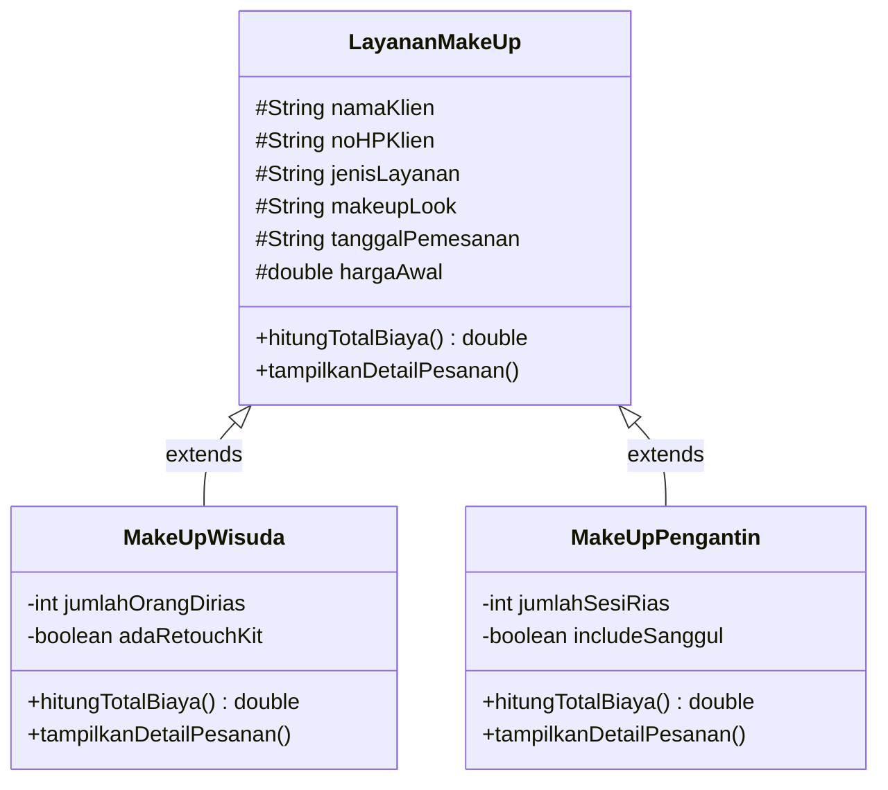

# MK-PBO-Sistem-Pengelolaan-Jasa-Make-Up
Nama : Sabrina Azhmalia Nisa

NIM : 2509116051

Kelas : Sistem Informasi B

---

## 1. Deskripsi Proyek

### Ringkasan Program

Program ini merupakan program berbasis konsol atau _command line_ yang mensimulasikan seorang Make Up Artist (MUA) untuk memanajemen usaha jasa make up mereka, mulai dari pencatatan data klien atau pelanggan, pemilihan kategori layanan, hingga perhitungan total biaya secara otomatis. Program ini berfokus pada jenis make up yang paling sering dipesan oleh masyarakat. Umumnya seorang MUA menawarkan lebih dari satu jenis layanan make up, seperti pada program ini yang menawarkan jenis layanan make up wisuda dan make up pengantin. 

### Kegunaan Program
Pada kedua jenis layanan tersebut memiliki karakteristik yang berbeda, baik dari segi harga dasar, cara perhitungan biaya, maupun detail tambahan yang ditawarkan. Pengelolaan pesanan secara manual akan menyulitkan MUA dalam mencatat data klien maupun menghitung total biaya secara konsisten. Maka dari itu, dibuatlah sistem ini agar menyelesaikan permasalahan tersebut. Adapun detail dari jenis make up tersebut pada program ini, antara lain:
|Kategori	| Harga Dasar |	Rumus Perhitungan Biaya |	Detail Tambahan|
|-----------|-----------|-----------|-----------|
|Make Up Wisuda |	Rp250.000 / orang	| Harga Dasar × Jumlah Orang + (Retouch Kit)	| Jumlah orang dirias, opsi Retouch Kit (+Rp50.000)|
|Make Up Pengantin |	Rp1.000.000 / sesi	| Harga Dasar × Jumlah Sesi + (Sanggul/Hairdo)	| Jumlah sesi rias, opsi Sanggul/Hairdo (+Rp200.000)|

---

## 2. Hierarki Class

Program ini terdiri dari lima class: empat class utama yang berkaitan, ditambah satu class pendukung untuk validasi input.



Class `SistemJasaMUA` dan `LayananValidator` tidak dimasukkan ke dalam diagram karena keduanya bukan bagian dari hierarki pewarisan. Adapun penjelasan tiap class adalah sebagai berikut:

| Class | Peran |
|---|---|
| `SistemJasaMUA` (Main Class) | Program utama yang menjalankan menu interaktif. Menangani input pengguna, membuat objek `MakeUpWisuda` atau `MakeUpPengantin` sesuai pilihan, dan menampilkan hasilnya. |
| `LayananValidator` | Class pendukung yang berisi method validasi input seperti `inputAngka`, `inputTanggal`, `inputNomorHp`, `inputYesNo`. |
| `LayananMakeUp` (Superclass) | Class induk yang menyimpan atribut umum semua layanan seperti nama klien, nomor HP, tanggal pengerjaan, dan tampilan make up atau _make up look_. |
| `MakeUpWisuda` (Subclass) | Mewarisi `LayananMakeUp`, dengan penambahan atribut jumlah orang yang dirias dan opsi Retouch Kit atau set make up kecil untuk merapikan riasan agar tetap terlihat *fresh*. |
| `MakeUpPengantin` (Subclass) | Mewarisi `LayananMakeUp`, dengan penambahan atribut jumlah sesi rias seperti sesi akad atau sesi resepsi, dan opsi Sanggul/Hairdo. |

---

## 3. Alur Program
Adapun struktur packages pada program ini adalah sebagai berikut:
```
src
 ├── Main
 │    └── SistemJasaMUA.java        → Program utama (menu dan alur)
 ├── Model
 │    ├── LayananMakeUp.java        → Superclass
 │    ├── MakeUpWisuda.java         → Subclass
 │    └── MakeUpPengantin.java      → Subclass
 └── controller
      └── LayananValidator.java     → Kumpulan validasi input
```

Berikut merupakan penjelasan alur program:

1. Program dimulai dan menampilkan menu utama, menu ini ditampilkan berulang sampai pengguna memilih Keluar.

   

2. Menu 1 (Tambah Pesanan), pengguna mengisi nama, nomor HP, dan tanggal pengerjaan. Nomor HP dan tanggal langsung divalidasi, sehingga pengguna diminta mengulang jika formatnya salah. Pengguna memilih kategori make up. Berdasarkan pilihan itu, program meminta data khusus jumlah orang dan Retouch Kit untuk make up wisuda, atau jumlah sesi dan Sanggul/Hairdo untuk make up pengantin. Program lalu membuat objek `MakeUpWisuda` atau `MakeUpPengantin` sesuai kategori, lalu menyimpannya ke `ArrayList`.

   

6. Menu 2 (Lihat Semua Pesanan), jika belum ada pesanan, program menampilkan pemberitahuan. Jika sudah ada, program menelusuri seluruh pesanan dengan *loop* dan menampilkan detail serta total biayanya.

   

8. Menu 3 (Keluar), program berhenti.

   


## 4. Penerapan Inheritance

Inheritance (pewarisan) diterapkan dengan menjadikan `LayananMakeUp` sebagai **superclass**, sedangkan `MakeUpWisuda` dan `MakeUpPengantin` sebagai dua **subclass** yang mewarisinya lewat kata kunci `extends`. Bentuk ini disebut *hierarchical inheritance*, yaitu satu superclass dengan beberapa subclass.


Tujuan penerapan inheritance pada program ini:

- **Kode tidak terduplikasi.** Atribut dan method yang bersifat umum cukup ditulis satu kali di `LayananMakeUp`, lalu otomatis dimiliki oleh kedua subclass.
- **Pemanggilan constructor induk melalui `super(...)`.** Setiap subclass memanggil constructor `LayananMakeUp` untuk mengisi data umum, sebelum melanjutkan pengisian atribut khususnya masing-masing.


---

## 5. Penerapan Polymorphism

Polymorphism pada program ini diterapkan lewat **method overriding**, di mama method milik superclass `LayananMakeUp` ditulis ulang oleh masing-masing subclass dengan isi yang berbeda. Ada dua method yang dioverride, yaiut:

### a. `hitungTotalBiaya()`: rumus berbeda untuk tiap kategori

Di superclass, method ini hanya mengembalikan harga dasar.
Penerapan pada subclass `MakeUpPengantin`.


Penerapan pada subclass `MakeUpWisuda`.


### b. `tampilkanDetailPesanan()`: tampilan berbeda untuk tiap kategori

Setiap subclass memanggil versi superclass dulu lewat `super.tampilkanDetailPesanan()` untuk mencetak data umum, lalu menambahkan informasi khususnya sendiri:


## 6. Penerapan Condition (If-Else)

Percabangan digunakan untuk menentukan langkah program berdasarkan pilihan atau kondisi data. Berikut merupakan penerapan condition.

**1. Menentukan kategori make up** 


**2. Menentukan *make up look* dari pilihan pengguna:**


## 7. Penerapan Looping

Perulangan digunakan agar program dapat berjalan terus-menerus dan memproses data yang jumlahnya tidak tetap. Ada tiga jenis perulangan yang dipakai.

**1. `do-while`: menu utama yang berulang.** 

Menu ditampilkan minimal satu kali dan terus berulang sampai pengguna memilih Keluar (3):


**2. `for`: menampilkan seluruh pesanan.** 

Perulangan menelusuri `ArrayList` dari pesanan pertama sampai terakhir, sehingga jumlah pesanan yang tampil menyesuaikan data yang ada:


**3. `while (true)`: mengulang permintaan input sampai valid.** 

Pada `LayananValidator`, program terus meminta input ulang sampai pengguna memasukkan data yang benar. Perulangan baru berhenti saat `return` dijalankan:


---

## 8. Dokumentasi Program

### 1. Menu Utama


### 2. Pilihan 1, Menambahkan Data Pemesanan Klien atau Pelanggan Baru


### 3. Pilihan 2, Melihat Semua Daftar Pemesanan


### 4. Pilihan 3, Keluar dari Program


---

## 9. Validasi Input

Aturan validasi yang diterapkan:

| Input | Aturan |
|---|---|
| Pilihan menu, kategori, look, jumlah orang/sesi | Harus berupa angka bulat |
| Nomor HP | Hanya angka (boleh diawali `+`), panjang 10-15 digit |
| Tanggal pengerjaan | Format `tanggal/bulan/tahun` dan harus tanggal yang benar-benar ada di kalender (misalnya `31/02/2026` ditolak) |
| Retouch Kit dan Sanggul/Hairdo | Hanya menerima Ya/Tidak |

### 1. Menu Utama


### 2. Input Nomor _Handphone_ Klien atau Pelanggan


### 3. Input Tanggal Pengerjaan


### 4. Input Kategori Make Up


